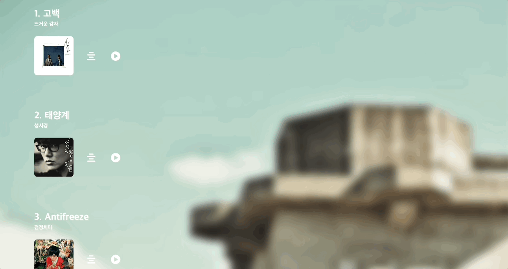

# 프로젝트 후기

## 들어가며

평소에 워낙 음악을 좋아하고, 스스로 만든 음악 재생 웹사이트를
구현하고자 작업하게 되었습니다.

## 주요 화면과 기능



-   나만의 음악 재생리스트 데이터 구성
    (원하는 기능의 API가 없었습니다.)
-   데이터를 받아와서 객체 key를 변수로 접근해서 일치하는 항목 get
-   음악에 맞는 가삿말 제공

```js

// 음악 차트 구성
const musicChart = {
   example : new Audio()
}

const getMusic = () => {
     음악데이터.forEach((item) => {
         // ...
            재생버튼.addEventListener('click', (e) => {
                if (e.target.matches('.fa-circle-play')) {
                    playButton.innerHTML = `<i class="fa-solid fa-circle-pause"></i>`;
                if (musicChart) {
                    console.log(musicChart);
                    // 객체 key를 변수로 접근
                    const selected = musicChart[item.audio];
                    return selected.play();
                }
            }
        }
}

// 가사 관련 매서드
const showUpWithLyric = (lyrics) => {
    $lyricContainer.classList.remove('lyric-hide');
    $lyric.innerText = lyrics;
};

const hideWithLyric = () => {
    $lyricContainer.classList.add('lyric-hide');
};

hideLyric.addEventListener('click', () => {
    hideWithLyric();
});


```

## 기존 기획과 달라진 점과 향후 계획

1. 코드 챌린지를 하는 과정에서 몽고디비에 저장해서 구현해야했다
2. Auth와 관련된 기능을 추가 X
3. music player를 만들어서 '재생, 다음 곡 넘기기, 되돌아오기'를 구현 X

이번 프로젝트는 자바스크립트로만 사용해서 구현하기엔 한계를 느꼈고
못 다한 기능과 백엔드 데이터는 다음 리액트 타입스크립트 프로젝트에 사용할 예정
